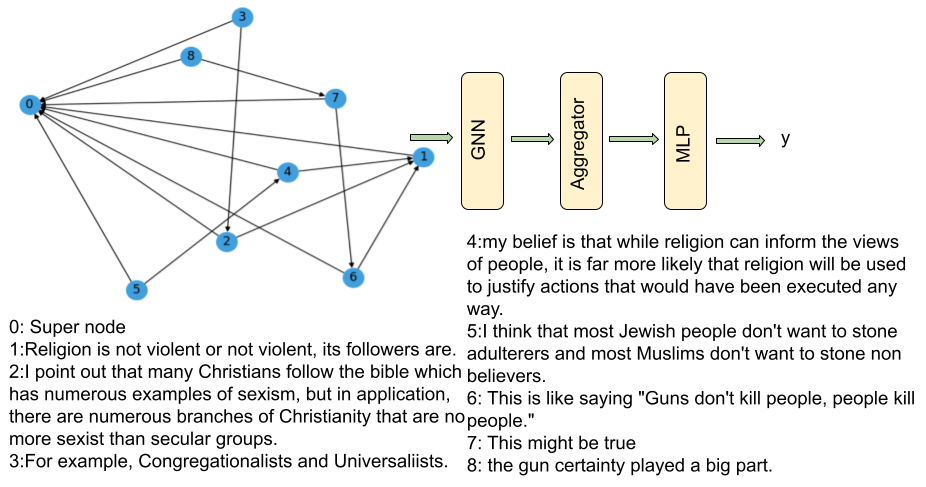

# Persuasive Arguments
Our work examines the extent to which a model might
benefit from learning over a graph with imposed discourse structure. We posit that the discourse knowledge
embedded in a graphical (discourse-level) representation
of an argument will serve as a helpful inductive bias when
predicting its persuasiveness.
In order to capture discourse structure during fine-tuning, we leverage Graph Neural Networks (GNNs) on
graph representations of persuasive arguments. Given
their ability to learn over graph inputs, GNNs can be
used to distinguish between effective and ineffective argument structures.

Our key idea is  to __capture the structural biases encoded within persuasive arguments using a GNN.__
Let us consider an argumentative proposition, represented as node $i$, and with embedding $h_i$. We leverage the graph structure to update $h_i$ as follows:
* Each proposition is  represented as node $i$ with embedding $h_i$.
* Node $i$'s set of neighbors, $N(i)$, is the collection of nodes with edges directed towards node $i$ (propositions that support or refute $i$).
* The representation of node $i$ is updated via message passing, by aggregating the representations of node $i$'s neighbors through a function, $U$. Notably, $U$ is invariant to the node's ordering and $W$ is a weight matrix.

 After constructing a graph representation for an input argument:

*  We encode the textual information within each argumentative proposition (node).
* We use message passing to update the embedding of each argumentative proposition among connected nodes.
*  To predict the persuasiveness of the entire argument structure, we aggregate information through either (max or average) pooling or a "super-node" like shown in the image below. 

     
Dependencies:
* transformers
* sentence-transformers
* torch
* torch-geometric
* torch-scatter
* torch-sparse
* datasets - might also neet cython
* lxml
* convokit
* numpy
* pandas
* wandb
* bs4

**Note:**  torch-geometric is incompatible with conda.
**Note:** need to use python version 3.8 or higher
